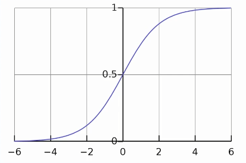

# SkLearn | Scikit Learn 编程练习100题

## 缺失值填充
### 001 检测数据每列的缺失值
问题:对于如下数据字典
1、构建pandas.DataFrame; 2、输出每列的缺失值的比例
data = { 
'size': ['XL','L','M', np.nan ,'M','M'],
'color': ['red','green','blue','green','red','green'],
'gender': ['female','male', np.nan,'female','female','male'],'price': [ 199.0 , 89.0, np.nan,129.0, 79.0, 89.0],
'weight': [ 500,450,300, np.nan, 410,np.nan ],'bought': ['yes','no','yes','no','yes','no']
}

### 002 填充数据列的缺失值
问题:
填充 weight 列的缺失值 使用平均值进行填充
上一例的数据`data`

### 003 获取填充缺失值的统计值
问题:
已经使用Simplelmputer
填充了缺失值，怎么知道填充了哪个数值?

### 004 使用常量填充缺失值
问题:
使用常量数字99.0 填充price一列的缺失值

### 005 使用最频繁数填充缺失值
问题:
size是字符串列、非数值列，使用出现最频繁的值做缺失值填充

### 006 按空值过滤并算均值
问题:
1、过滤掉weight为空值的行;
2、筛选出数字类型的列;
3、计算这些列的均值

### 007 使用常量填充字符串列
问题:
1、筛选出字符串类型的列( object类型)
2、使用常量字符串empty进行填充

## 数值离散化
### 008 数值离散化等宽区间
问题:新增一列weight_cut,分成3个等间距区间，实现离散化

 - |weight
--|---   
0|75.0
1|78.5
2|85.0
3|91.0
4|84.5
5|83.0
6|68.0

转化为

- |weight|weight_cut
--|---|--   
0|75.0|(67.977, 75.667]
1|78.5|(75.667, 83.333]
2|85.0|(83.333, 91.0]
3|91.0|(83.333, 91.0]
4|84.5|(83.333, 91.0]
5|83.0|(75.667, 83.333]
6|68.0|(67.977, 75.667]

注意: weight_cut变成了分类类型

### 009 数值离散化指定区间
问题:新增一-列weight_cut， 自己指定区间为(60, 75, 80, 95)，实现离散化

- |weight
--|---   
0|75.0
1|78.5
2|85.0
3|91.0
4|84.5
5|83.0
6|68.0

转化为

- |weight|weight_cut
--|---|--   
0|75.0|(60, 75]
1|78.5|(75, 80]
2|85.0|(80, 95]
3|91.0|(80, 95]
4|84.5|(80, 95]
5|83.0|(80, 95]
6|68.0|(60, 75]

注意: weight_cut变成了分类类型

### 010 数值离散化-区间标签
问题:新增一列weight_cut， 自己指定区间为(60, 75, 80, 95)，并且指定标签，实现离散化

- |weight
--|---   
0|75.0
1|78.5
2|85.0
3|91.0
4|84.5
5|83.0
6|68.0

转化为

- |weight|weight_cut
--|---|--   
0|75.0|light
1|78.5|normal
2|85.0|heavy
3|91.0|heavy
4|84.5|heavy
5|83.0|heavy
6|68.0|light

注意: weight_cut变成了分类类型

### 011 数值离散化-虚拟编码
问题:
1. 新增一列weight_cut， 自己指定区间为(60, 75, 80, 95)，并且指定标签，实现离散化
问题:
2. 使用pd.get_dummies实现虚拟编码

- |weight
--|---   
0|75.0
1|78.5
2|85.0
3|91.0
4|84.5
5|83.0
6|68.0

转化为

- |weight|weight_cut_light|weight_cut_normal|weight_cut_heavy
--|---|---|---|---|   
0|75.0|1|0|0|
1|78.5|0|1|0|
2|85.0|0|0|1|
3|91.0|0|0|1|
4|84.5|0|0|1|
5|83.0|0|0|1|
6|68.0|1|0|0|

## 特征提取
### 012 特征提取-元素的个数
问题:有一列是list类型， 新增一列number，为这一list列的元素个数

### 013 特征提取是否包含元素
问题:有一列是list类型，新增一列USD_flag， 如果第一列包含USD则是1， 否则是0

### 014 特征提取-从字符串提取标签
问题:从一个大字符串，提取多个标签tag，变成普通的列

### 015 特征提取每行缺失值个数
问题:每一行有一些空值，计算这一 行空值的个数，给一-个新字段missing

### 016 特征提取-字符串清理转数字
问题:一个字符串列，提取里面的数字.

## IRIS数据 
使用IRIS数据集，完成如下步骤
- P17 使用load_iris加载iris数据集， 查看包含的Keys
- P18 查看数据的列名、分类目标的名称
- P19 获取data和target,并打印各自的shape
- P20 拆分训练集和测试集
- P21 使用逻辑回归训练，在测试集_上计算准确率
- P22 在测试集_上实现预估
- P23 输出和理解混淆矩阵
- P24 输出和理解分类报告

## 特征编码
### 025 特征编码-预估目标列
bought 一列是预估目标，从字符串类型转换成数字类型

### 026 特征编码-one-hot编码
普通的特征列，使用one hot编码，转换成数字

## 乳腺癌数据集
### 027 加载数据集 查看数据集描述
### 028 加载数据集 获取并查看如下数据
### 029 合并 data和 target
行数相同，列数不同
问题:把data和target，在列方向，上合并成一个大数组
### 030 生成Pandas 的 df
特征data和目标target
生成一个pandas.dataframe
- data和target合并作为数据
- feature_ names和"target"作为列名
### 031 拆分训练集和测试集
设置random_ state种子: 为随机生成器设置一个种子。 以便您的训练测试分割始终是确定性的。
如果不设置种子，每次都不一样。
设置test_size :表示要包含在拆分中的测试数据集的比例
### 032 训练测试集数据分布
拆分成训练集和测试集后
查看如下三个数据的分布:
target:原数据的预估目标列
y_train: 训练集的预估目标列
y_test: 测试集的预估目标列
### 033 训练测试集的均匀拆分
拆分成训练集和测试集后
查看如下三个数据的分布:
target:原数据的预估目标列
y_train: 训练集的预估目标列
y_test: 测试集的预估目标列
让三个数据的分布保持相同(train_test_split的stratify参数)

## 034 线性回归
Numpy正规方程线性回归
输入两列的Numpy矩阵，用Numpy正规方程实现拟合特征: years工作年限;预估: salary薪资;

no|years|salary
--|--|--
0|1|4000
1|2|4250
2|3|4500
3|4|4750
4|5|5000
5|6|5250

原始方程(其中X: years; y: salary) :
$\theta^0 + \theta^1 $
$ X \theta = y $
正规方程的解（参照吴恩达机器学习课程-正规方程一集)
$ \theta = (X^TX)^{-1} (X^Ty) $

Numpy实现
theta = np.dot(np.linalg.inv(np.dot(X.T,X)),np.dot(X.T,Y))
### 035 线性回归- sklearn实现线性回归
特征: years工作年限;预估: salary薪资;

### 036 线性回归-读取csv实现线性回归
输入两列的CSV文件:变量variable、预估目标target使用sklearn实现线性回归，打印评估分数

### 037 多项式特征单个变量的多项式特征
通过增加输入数据的非线性特征，来增加模型的复杂性通常很有用
degree= 2
一个特征变成3个特征
X——>1,X, X^2

### 038 多项式特征 -多个变量的多项式特征
通过增加输入数据的非线性特征，来增加模型的复杂性通常很有用
degree = 2
2个特征变成6个特征
X,Y———>1, X, Y, X^2, XY, Y^2

### 039 数值标准化 读取CSV实现数值标准化
读取CSV，对多个列实现标准化StandardScaler
z=(x-u)/ s

### 040 数值标准化-训练测试集数值标准化
在train.csv上训练StandardScaler,在train+test.csv上实现转换

### 041 数据指标计算-平均绝对误差MAE
平均绝对误差( MAE，mean absolute error)
表达相同现象的成对观测值之间误差的度量

no|y_true|y_pred
--|--|--|
0|109.934283|113.175123
1|97.234714|93.383891
2|112.953771|106.184551
3|130.460597|136.577360
4|95.316933|105.626928

$MAE=\frac{1}{n}\sum_{j=1}^n|y_j-\hat{y_j}|$

### 042数据指标计算一均方误差MSE
均方误差( MSE mean squared error)
表达估计值和实际值之间的平均平方误差

$MAE=\frac{1}{n}\sum_{i=1}^n(y_i-\tilde{y_i})^2$

### 043 数据指标计算 - Sigmoid函数
Sigmoid函数是-个在生物学中常见的S型函数
常被用作神经网络的激活函数，将变量映射到0,1之间

$\hat{y}=\sigma(z)=\frac{1}{1+e^{-z}} $

### 044 数据指标计算- entropy熵函数
熵的概念最早起源于物理学，用于度量一个热力学系统的无序程度。
在信息论里面，熵是对不确定性的测量，越随机的信源的熵越大

熵的公式可以表示为
$H(X)=\sum_i{P(x_i)I(x_i)}=-\sum_i{P(x_i)\log_b{P(x_i)}}$

### 045 数据指标计算-准确率accuracy_ score
accuracy_ score 
计算准确率，即正确预测的分数(默认)或计数(normalize=False )

$accuracy(y,\hat{y}) = \frac{1}{n_{sample}} \sum_{i=0}^{n_{sample}-1}1(\hat{y}-y_i)$
### 046 数据指标计算-混淆矩阵confusion_matrix
混淆矩阵
也称误差矩阵，表示精度评价的一种标准格式， 用n行n列矩阵形式来表示
混淆矩阵的每一列代表了预测类别，每一列的总数表示预测为该类别的数据的数目;每一行代表了数据的真实归属类别，每- - -行的数据总数表示该类别
的数据实例的数目。
如有150个样本数据，预测为1,2,3类各为50个。 分类结束
预测
后得到的混淆矩阵为:
每一行之和表示该类别的真实样本数量,每一列之和表示被预测为该类别的样本数量,第一行说明有43个属于第一类的样本被正确预测为了第一类，有两个属于第一类的样本被错误预测为了第二类

## 决策树 
### 047决策树 使用决策树训练分类模型
决策树学习的算法
通常是一个递归地(根据某- -准则， 信息增益或基尼系数)
选择最优切分点/特征，并根据该特征对训练数据集进行分割,使得对各个子数据集有一个最好的分类过程
这一过程对应着对特征空间的划分，也对应着决策树的构建，继续在子数据集上循环这个切割的过程，直到所有的训练数据子集被基本正确分类，或者没有合适的特征为止。

Sklearn函数make_moons:
生成一个简单的玩具数据集，用于可视化聚类和分类算法
make_moons(n_samples=2000, noise=0.25, random_ state=42)
n_numbers:生成样本数量
noise:默认是false,数据集是否加入高斯噪声
random_state:生 成随机种子，给定-个int值，能够保证每次生成数据相同
问题:
训练DecisionTreeClassifier分类模型
打印模型的准确率accuracy

